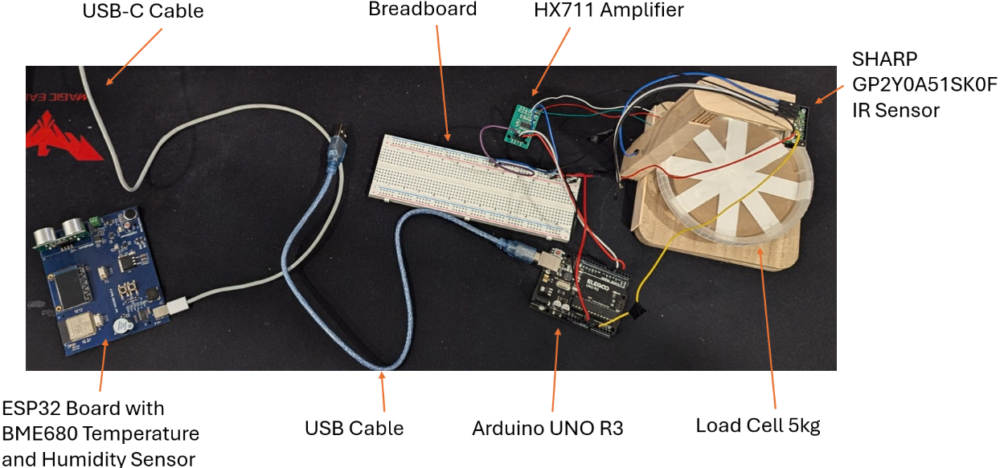

# Automated Snow Detection System for Solar Panels

## Project Overview

Our proposed solution incorporates multiple sensors, such as:

- **Load cells**
- **Ultrasonic sensors**
- **Infrared distance sensors**
- **Temperature and humidity sensors**

Our proposed solution incorporates various sensors such as load cells, ultrasonic sensors, infrared distance sensors, temperature, and humidity sensors. The integrated approach will provide real-time monitoring and live data collection to ensure solar panels perform as efficiently as possible during winter conditions. Given the available material, the system will be simulated at a smaller scale involving a small plastic plane mimicking the solar panels. The system will thus demonstrate how the chosen sensors can accurately detect snow buildup, measure its thickness, and potentially initiate actions to remove the snow in the future. This will be demonstrated by applying a layer of snow for the system to detect and provide the appropriate reading and indication.

### System Setup

- The system is simulated at a smaller scale using a **small plastic plate** to mimic solar panels as shown in

.

- Sensors will accurately:
  - Label snow accumulation

## Code and Scripts

This project involves two Arduino scripts and a Python script which are provided.

#### **`WeightDistanceMeasurement.ino`**

- **Purpose**: Handles data from a load cell and infrared distance sensor using code adapted from Ahmad Shamshiri for robojax.com on July 09, 2020 in Ajax, Ontario, Canada.
- **Hardware**:
  - Arduino Uno R3
  - Load cell and infrared distance sensors connected.
- **PORT**:
  - This script communicates through **COM4**.

#### **`TemperatureHumidityMeasurement.ino`**

- **Purpose**: Handles temperature and humidity data using a BME680 sensor using a script heavily inspired by Assignment 1 MIE1050 from University of Toronto.
- **Hardware**:
  - ESP32-s3 board
  - BME680 sensor
- **PORT**:
  - This script communicates through **COM5**.

### 2. Python Script

#### **`SnowPrediction.py`**

- **Purpose**: Processes data collected from the sensors and uses a **Random Forest classifier** to predict snow accumulation.
- **Requirements**:
  - A **dummy dataset** is provided for training the Random Forest model called **snowData.csv**.
  - The dataset includes:
    - Temperature
    - Relative humidity (%)
    - Snow accumulation distance (mm)
    - Snow density (kg/m cube) 
---

## System Function

1. **Sensor Data Collection**:
   - **Arduino Uno R3** collects weight and distance data using the `weight_distance_measurement` script.
   - **ESP32** collects temperature and humidity data using the `temp_humidity_measurement` script.
2. **Data Transfer**:
   - Sensor data is sent via serial communication (COM4 and COM5).
3. **Data Processing**:
   - The Python script consolidates the data and uses a **Random Forest model** for predictions.
4. **System Demonstration**:
   - A layer of snow is applied to test the system’s ability to detect snow buildup and thickness.

---

## Requirements

### Hardware
- Arduino Uno R3
- ESP32
- Load cell
- Infrared distance sensor
- BME680 sensor
- Plastic plane (as a solar panel simulation)

### Software
- Arduino IDE
- Python 3.x
- Required Python libraries:
  - `numpy`
  - `pandas`
  - `scikit-learn`
  - `pyserial`
---

